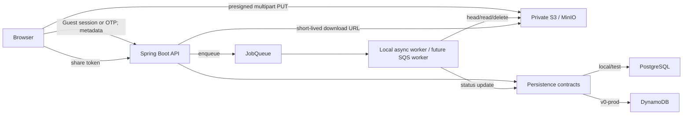

# fly.ae V0 architecture

## Repository

```text
/
├── apps/
│   ├── web/       Next.js, React, TypeScript and Uppy
│   ├── backend/   Kotlin Spring Boot REST API
│   └── worker/    future independent worker deployment boundary
├── docs/          Architecture, OpenAPI and design system
└── infra/         Docker Compose, MinIO bootstrap and local configuration
```

## Runtime view



Local V0 uses an in-process `JobQueue` and deterministic
`DocumentClassifier`. The interfaces are stable boundaries for an SQS adapter
and an AI-backed classifier later.

Persistence uses the same pattern: services depend on repository contracts.
Local/test selects the JPA/Flyway PostgreSQL adapter; `v0-prod` selects the AWS
SDK DynamoDB adapter. See [`persistence.md`](./persistence.md).

## Vertical slices

### 1. Email OTP

`POST /auth/otp/request` normalizes the email, rate-limits the request and stores
only a hash of the code. `POST /auth/otp/verify` consumes the code once, creates
or loads the user and returns a short-lived bearer session.

### 1a. Telegram OTP

`GET /auth/otp/options` сообщает Web, включён ли Telegram. Telegram-вход начинается
с первого экрана авторизации и не требует email. `POST /auth/telegram/request`
создаёт короткоживущий browser `requestId` и отдельный случайный token, после
чего возвращает `t.me/<bot>?start=<token>`.

После нажатия пользователем Start Telegram вызывает
`POST /auth/telegram/webhook`. Backend проверяет секретный webhook header,
находит HMAC deep-link token, записывает Telegram user/chat ID и отправляет
шестизначный OTP в private chat. В базе хранится только hash OTP.

`POST /auth/telegram/verify` принимает browser `requestId`, OTP и legal consent,
одноразово погашает запрос, создаёт или загружает пользователя по неизменяемому
Telegram user ID и возвращает bearer session. Email- и Telegram-пользователи V0
имеют разные профили; автоматического объединения аккаунтов нет.

Alternatively, `POST /guest/sessions` records Terms/Privacy acceptance and
returns a 12-hour capability token for one document. It does not create a User
and cannot list My Documents.

### 2. Document metadata

A user or guest selects a seeded category and submits MSN, filename,
`application/pdf` and byte size. The backend creates `Document(CREATED)` with
exactly one owner and returns its identifier. Guest files are capped at 100 MiB;
authenticated files at 3 GiB.

### 3. Multipart upload

The API creates a multipart session in private object storage and returns the
opaque upload ID and object key. Uppy asks the API to sign each part, uploads
parts directly, then sends ETags to the completion endpoint.

### 4. Processing

Completion moves the document to `PENDING`, verifies the stored object and
enqueues a `ProcessingJob`. The local worker moves it through `PROCESSING` to
`APPROVED`. Future PDFBox and LLM work stays behind `DocumentClassifier`.

### 5. Sharing and My Documents

Approval creates a cryptographically random `ShareToken`. The public share
endpoint reveals only safe metadata and a short-lived download URL. Authenticated
owners can list and delete documents; deletion removes the S3 object and
invalidates its share token.

## Security boundaries

- A user or scoped guest bearer token is required for every upload and document mutation.
- Ownership is checked server-side on every document endpoint.
- Upload signatures expire after one hour and are scoped to one object and part.
- The bucket is private; share access goes through a token lookup.
- OTP and upload/share endpoints have independent rate limits.
- OTP values and document contents are never written to production logs.
- Secrets are injected through environment variables.
- Soft-deleted documents are excluded from normal queries; object deletion is
  part of the delete operation.

## Source-of-truth documents

- API contract: [`api/openapi.yaml`](./api/openapi.yaml)
- PostgreSQL model: [`database.md`](./database.md)
- Persistence adapters: [`persistence.md`](./persistence.md)
- Product assumptions: [`assumptions.md`](./assumptions.md)
- Design system: [`design-system.md`](./design-system.md)
