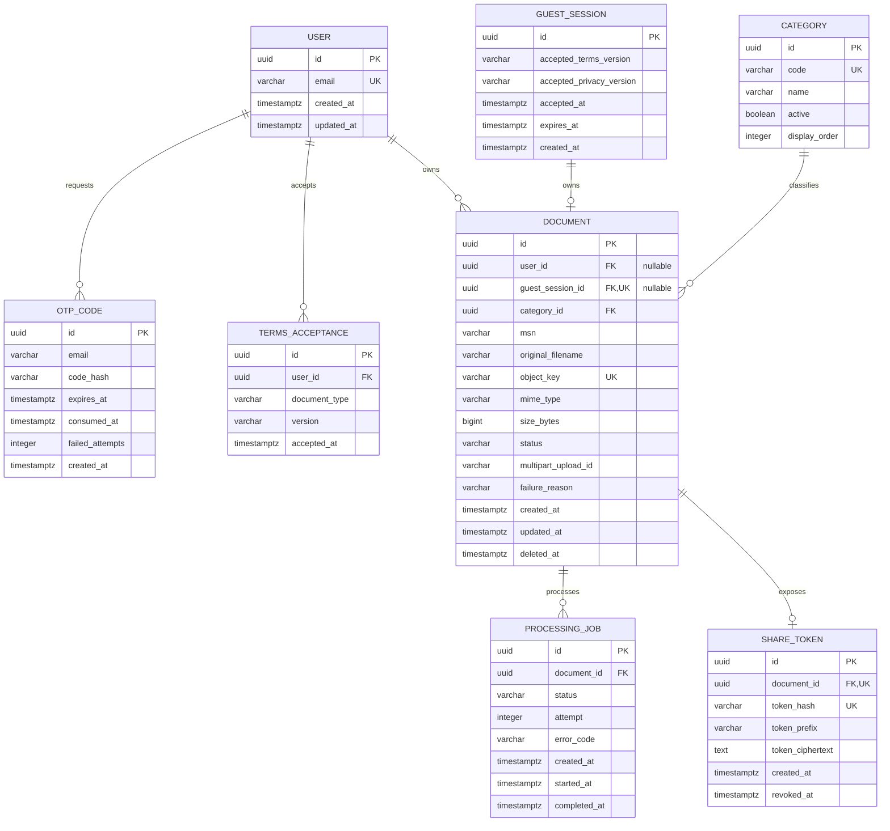

# Database model

PostgreSQL is authoritative for users, authentication attempts, document
metadata, processing state and share capability tokens. UUID primary keys are
generated by the application.



`documents_exactly_one_owner` requires either `user_id` or `guest_session_id`,
never both. `documents_one_per_guest` limits each guest capability to one
document.

## Document transitions

```text
CREATED → UPLOADING → PENDING → PROCESSING → APPROVED
                                  ├────────→ REJECTED
                                  └────────→ FAILED

Any owner-controlled non-terminal or terminal state → DELETED
```

Only `APPROVED` documents may own an active `ShareToken`.

## Seed categories

V0 starts with the four categories represented in the approved UI kit:

1. Aircraft
2. APU
3. Engine
4. Landing Gear
