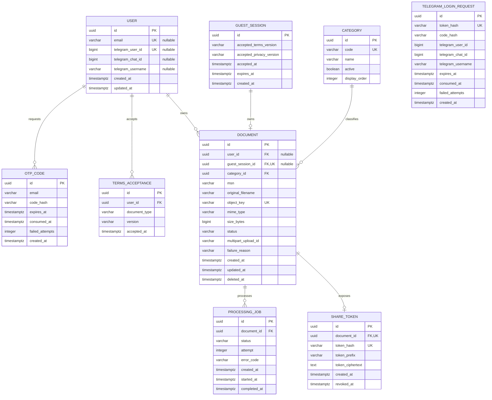

# PostgreSQL database model

PostgreSQL is authoritative for local development and PostgreSQL-backed
deployments. It stores users, authentication attempts, document metadata,
processing state and share capability tokens. UUID primary keys are generated
by the application. V0-Prod uses the equivalent DynamoDB adapter described in
[`persistence.md`](./persistence.md).



`documents_exactly_one_owner` requires either `user_id` or `guest_session_id`,
never both. `documents_one_per_guest` limits each guest capability to one
document. `users_exactly_one_login_identity` requires either email or Telegram
user ID, never both. `telegram_login_requests` stores only HMAC values for the
deep-link token and OTP; the browser holds the request UUID while the raw token
exists only in a short-lived `t.me` URL.

## Document transitions

```text
CREATED → UPLOADING → PENDING → PROCESSING → APPROVED
                                  ├────────→ REJECTED
                                  └────────→ FAILED

Any owner-controlled non-terminal or terminal state → DELETED
```

Only `APPROVED` documents may own an active `ShareToken`.

## Seed categories

V0 starts with the four categories represented in the approved UI kit:

1. Aircraft
2. APU
3. Engine
4. Landing Gear
