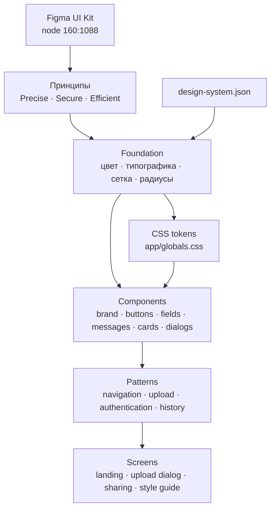
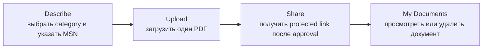
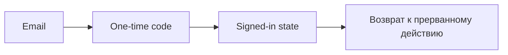

# Дизайн-система fly.ae

Версия: **1.0.0**

Статус: **активна**

Источник: [Figma UI Kit — узел 160:1088](https://www.figma.com/design/p8QjkewBdCS8qv1J21OoxW/fly.ae?node-id=160-1088&t=78eXDSBlGsjRRSB5-1)

Живая демонстрация: [`/style-guide`](../apps/web/app/style-guide/page.tsx)

Этот документ фиксирует визуальный язык fly.ae и правила его применения. Машиночитаемая версия находится в [`design-system.json`](./design-system.json), а фактические CSS-токены — в [`apps/web/app/globals.css`](../apps/web/app/globals.css).

## Дизайн-схема



### Иерархия

1. **Принципы** определяют характер интерфейса.
2. **Foundation** задаёт общие токены.
3. **Components** собирают токены в повторяемые элементы.
4. **Patterns** задают поведение группы компонентов.
5. **Screens** применяют паттерны к пользовательскому сценарию.

## Принципы

### Precise

Техническая информация компактна, выровнена и быстро считывается. Элементы не используют декоративные детали без функциональной причины.

### Secure

Состояния и последствия действий показаны явно. Для загрузки, проверки, успешного завершения и ошибок используются разные семантические цвета и понятный текст.

### Efficient

На одной поверхности должен быть один главный призыв к действию. Названия действий короткие и начинаются с глагола: **Upload**, **Share**, **Copy**, **Complete**.

## Foundation

### Цвет

| Роль | Токен | Значение | Применение |
|---|---|---:|---|
| Flight navy | `--color-ink` | `#101A3A` | Бренд, текст, навигация, primary actions |
| Sky blue | `--color-sky` | `#258FE0` | Категории и выбранные состояния |
| Deep sky | `--color-sky-deep` | `#075BB7` | Градиенты карточек и метки |
| Signal green | `--color-success` | `#35C63F` | Успешные и завершённые состояния |
| Alert coral | `--color-danger` | `#E34C61` | Ошибки, required и destructive actions |
| Information | `--color-info` | `#EAF6FB` | Информационные блоки |
| Warning | `--color-warning` | `#FFD9C8` | Проверка и предупреждения |
| Cloud | `--color-canvas` | `#F4F6FA` | Фон страницы и групп |
| Steel | `--color-muted` | `#6F7A91` | Вторичный текст и метаданные |
| Line | `--color-line` | `#D8DEE9` | Разделители и границы |

Насыщенные дополнительные цвета используются только как носители смысла. Они не применяются как случайный декор.

### Типографика

Основной характер задаёт узкий гротеск:

```css
"Arial Narrow", "Roboto Condensed", "Helvetica Neue", Arial, sans-serif
```

| Стиль | Размер / интерлиньяж | Вес |
|---|---:|---:|
| Display | `56 / 56` | `800` |
| Heading 1 | `40 / 44` | `800` |
| Heading 2 | `32 / 36` | `800` |
| Body | `16 / 24` | `400` |
| Caption | `12 / 16` | `700` |

Заголовки используют плотный трекинг. Основной текст сохраняет свободный интерлиньяж. В интерфейсе применяется sentence case.

### Сетка

Базовый шаг — **4 px**. Рабочая шкала:

`4 · 8 · 12 · 16 · 24 · 32 · 48 · 64`

Максимальная ширина основного контента — `1120 px`. Мобильная боковая отбивка — `20 px`, desktop — не менее `24 px`.

### Радиусы

- `6 px` — кнопки, поля, небольшие сообщения;
- `10 px` — карточки и сгруппированные поверхности;
- `14 px` — диалоги;
- `50%` — только аватары и круглые status indicators.

Pill-кнопки и чрезмерно скруглённые панели не относятся к языку fly.ae.

## Компоненты

### Brand

Используется lockup из знака и слова `fly.ae`.

- Канонический знак приложения — левая «муха» из **Brand / Variant 3** Figma UI Kit: петля-крылья, контурная круглая голова и два коротких наклонных луча.
- Для иконки приложения используется этот же знак без wordmark.
- Знак в виде самолёта относится к устаревшим макетам и не используется, даже если он встречается на отдельных экранах прототипа.
- На светлом фоне — Flight navy.
- На Flight navy — белый.
- Нельзя подчёркивать, растягивать или отдельно перекрашивать буквы.
- Свободное поле вокруг lockup не меньше высоты строчной `f`.

Реализация: `.brand`, `.brand-mark`, `.brand-word`.

### Buttons

Высота основных контролов — `44 px`, радиус — `6 px`.

| Вид | Класс | Назначение |
|---|---|---|
| Primary | `.button-primary` | Главное действие поверхности |
| Success | `.button-success` | Подтверждение успешного шага |
| Secondary | `.button-secondary` | Альтернативное действие |
| Tertiary | `.button-tertiary` | Низкоприоритетная ссылка-действие |
| Icon | `.button-icon` | Компактная самостоятельная команда |

Disabled-состояние должно оставаться видимым и не реагировать на hover.

### Fields

- Label всегда остаётся над полем.
- Обязательность обозначается coral-звёздочкой.
- Ошибка содержит coral-border и поясняющий текст под полем.
- Placeholder не заменяет label.
- Базовая высота поля — `44 px`.

### Messages

Информационные, предупреждающие и успешные состояния содержат заголовок и пояснение. Цвет всегда дублируется текстом.

### Category card

Карточка категории использует градиент `Sky blue → Deep sky`, белый текст и короткую структуру:

1. категория;
2. основной идентификатор;
3. одна строка метаданных.

Реализация: `.folder-card`, `.empty-folder-card`.

### Dialog

- Радиус `14 px`;
- close action расположен справа сверху;
- основной action находится в нижней зоне;
- на мобильном диалог закрепляется у нижнего края;
- фокус остаётся визуально заметным.

## Паттерны

### Navigation

Desktop: бренд слева, продуктовая навигация по центру, пользователь или Log in справа.

Mobile: бренд слева, avatar и menu action справа.

### Upload flow



### Authentication flow



## Соответствие коду

| Слой | Файл |
|---|---|
| Машиночитаемая схема | [`docs/design-system.json`](./design-system.json) |
| CSS-токены и компоненты | [`apps/web/app/globals.css`](../apps/web/app/globals.css) |
| Живой style guide | [`apps/web/app/style-guide/page.tsx`](../apps/web/app/style-guide/page.tsx) |
| Product screenflow | [`apps/web/app/page.tsx`](../apps/web/app/page.tsx) |
| Проверка рендера | [`apps/web/tests/rendered-html.test.mjs`](../apps/web/tests/rendered-html.test.mjs) |

## Правило изменений

При изменении дизайна в одном pull request обновляются:

1. утверждённый Figma UI Kit;
2. `docs/design-system.json`;
3. CSS custom properties и component classes;
4. `/style-guide`;
5. затронутые экраны и тесты.

Порядок источников истины: **Figma → JSON manifest → CSS tokens → components → screens**.
